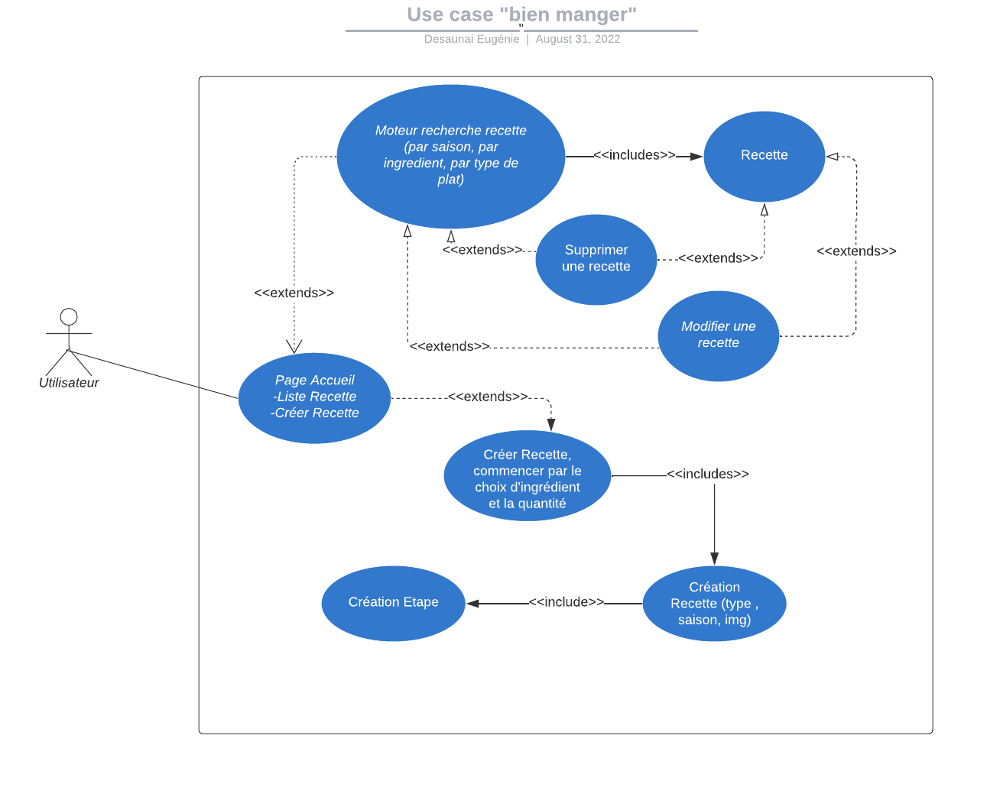
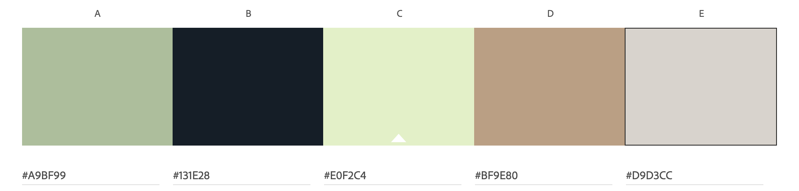
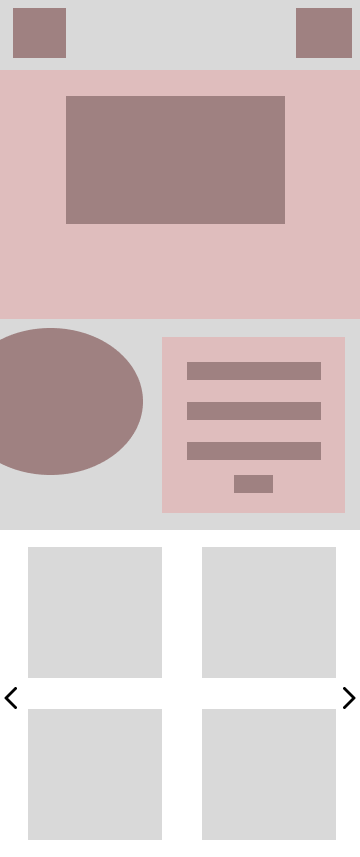
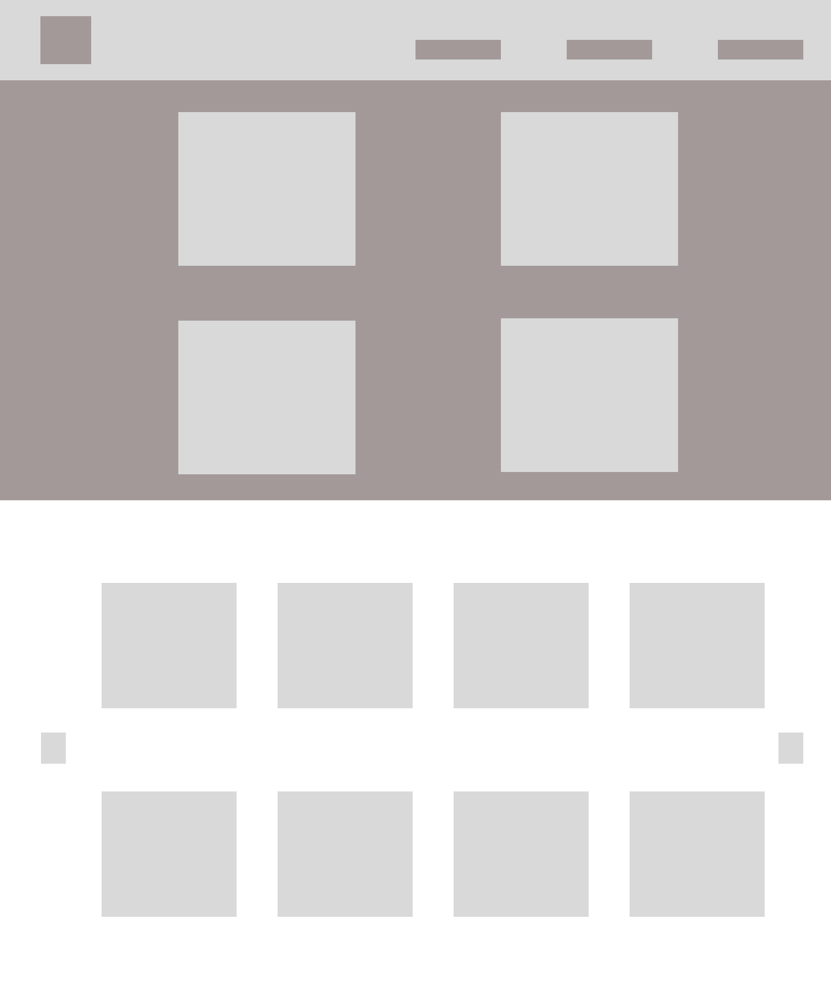
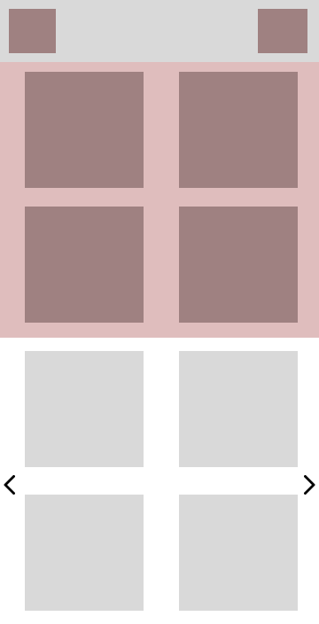
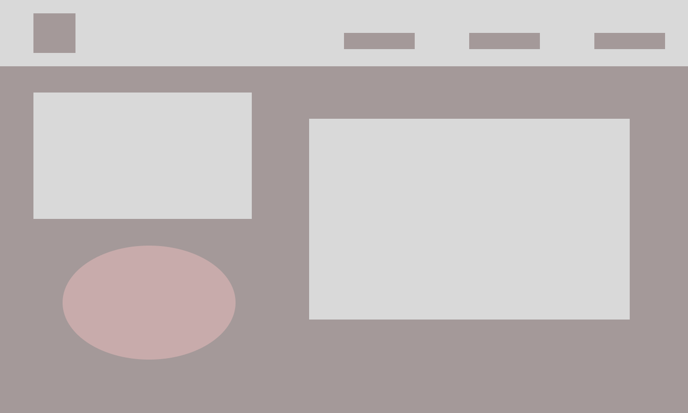
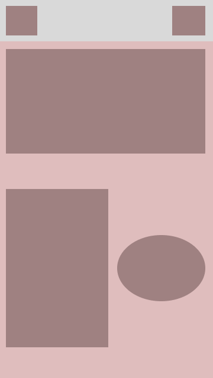
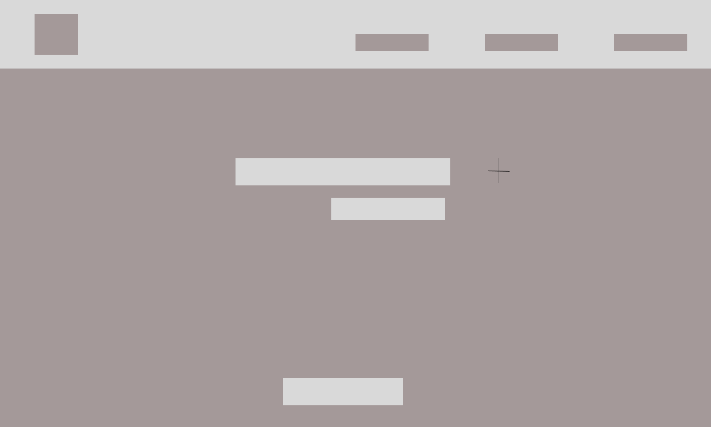
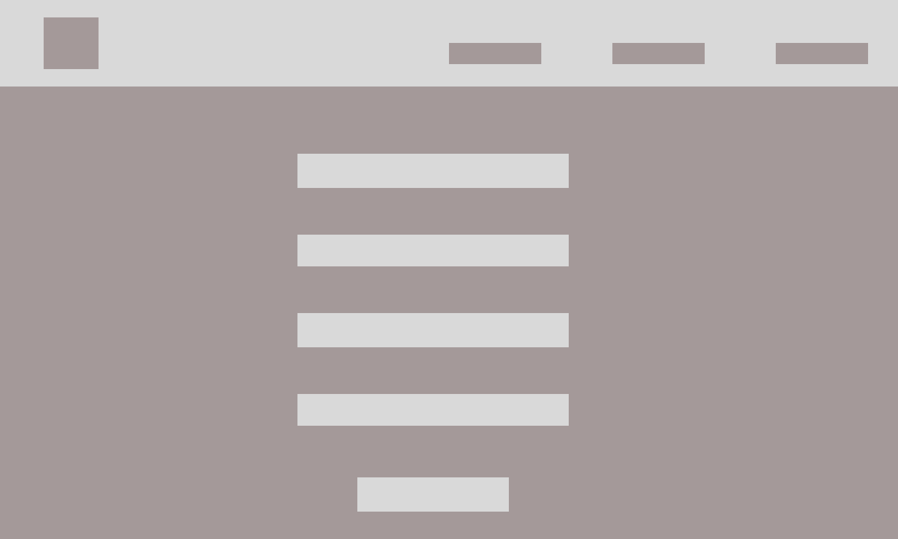
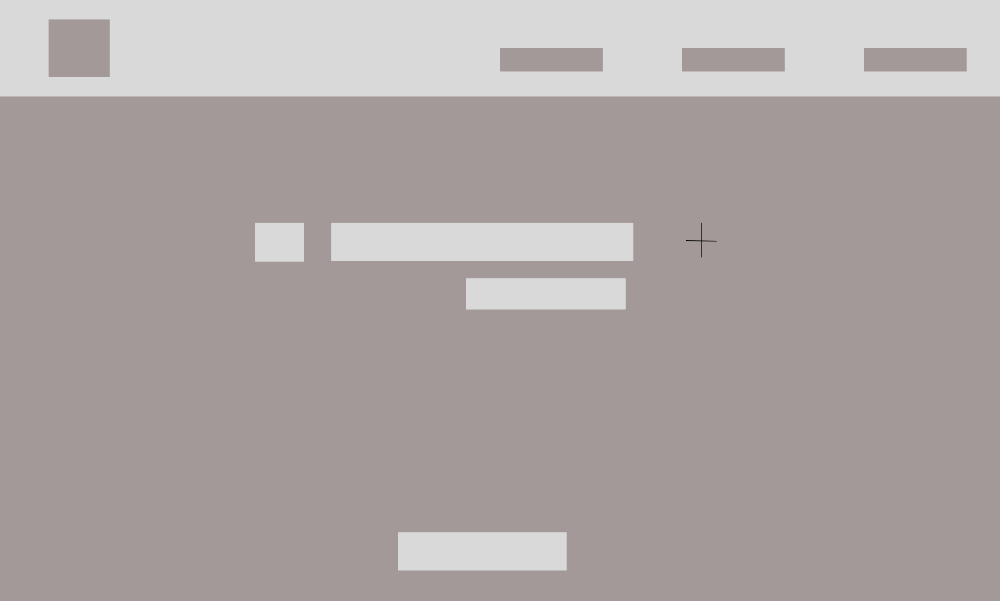

# bien-manger_vue

# Installation
Run npm install  
Copy .env.sample file to .env file  
Define the variables  
.env : npm install dotenv  
npm install vue3-carousel  

## Use Case

# Charte Graphique 

#A9BF99  
#131E28  
#E0F2C4  
#BF9E80  
#D9D3CC  
 
# Zoning

# Wireframe Ordinateur

.png)
.png)
.png)

# Usage 

Extensions installées:
Vue Router
Vuex

# Amélioration à effectuer
Faire la barre de recherche sur la HomePage  
Bouton envoyer du formulaire, renvoie sur la page de la recette qui vient d'être créer  
Bouton précédent sur formulaire 